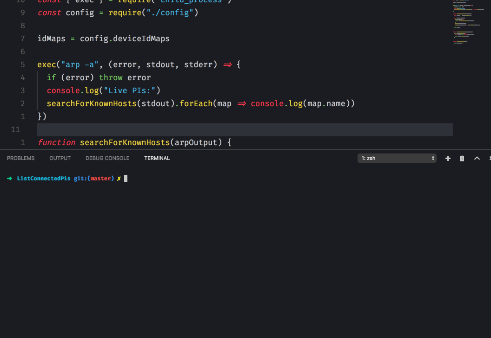
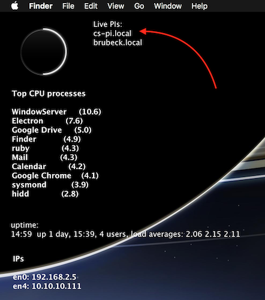
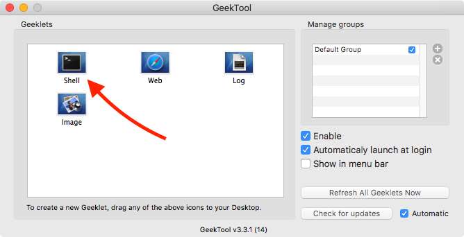
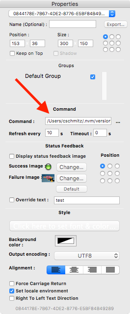

# Live devices on the network

_Given a map of names and mac address, list target devices on the network._

This is a quick and dirty file I rattled out to list my raspberry pis on a local network. I wrote this specifically to work with [GeekTool](https://www.tynsoe.org/v2/geektool/).

At the moment this is a mac only tool because:

- arp is a *nix command
- Geektool is a mac only application
- I use a mac and this was a quick script

All that said, if you want to submit a PR to make it work on windows or linux I wouldn't turn it down ;)

## Installation

This assumes you already have GeekTool installed.

- Pull down this repository
- Open GeekTool
- Drag a new `shell` geeklet onto your desktop

- Once it's on your desktop, a `properties` window will show

- type in the path to your node binary and path to the command
    - Note that both of these should be absolute paths!

            e.g.
            /Users/cschmitz/.nvm/versions/node/v6.3.1/bin/node /Users/cschmitz/Development/CS/Projects/ListConnectedPis/index.js

- Set the geeklet to refresh on whatever interval you feel comfortable with
    - I have mine set at every 10 seconds at the moment
- Adjust your font style and you're done :)